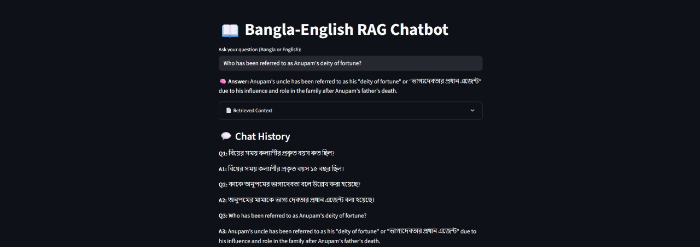
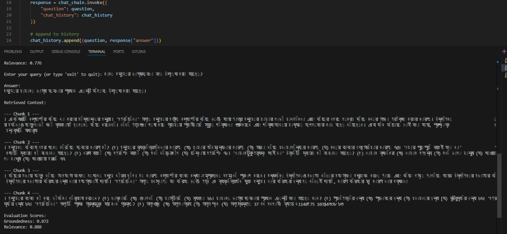

# Bangla-English RAG Chatbot(BanglaBOT)

This is a Retrieval-Augmented Generation (RAG) based chatbot designed to answer questions in **Bangla** and **English** using content extracted from Bangla educational PDFs (e.g., HSC textbooks). It supports:
- PDF OCR extraction using Tesseract (Bangla language)
- Embedding and vector storage using OpenAI Embeddings and ChromaDB
- Conversational RAG with history using LangChain
- Evaluation of generated answers with relevance and groundedness scores
- Streamlit UI and Flask API support

---

## Demo Screenshots

### 1. Streamlit UI – Query and Output


## 2. Evaluation Metrics Output  

This module evaluates the chatbot using two metrics:  
- **Groundedness** → How well the answer is supported by the retrieved context.  
- **Relevance** → How relevant the retrieved context chunks are to the query.  

**Example:**  
> **Query:** কাকে অনুপমের ভাগ্যদেবতা বলে উল্লেখ করা হয়েছে?  
> **Answer:** অনুপমের মামাকে ভাগ্যদেবতার প্রধান এজেন্ট বলা হয়েছে.  

**Scores:**  
- Groundedness: **0.872**  
- Relevance: **0.888**  

  

### How it works  
The [`evaluate.py`](evaluate.py) script:  
1. Takes user query & chatbot answer.  
2. Retrieves context chunks.  
3. Calculates cosine similarity for **Groundedness** & **Relevance**.  

**Run:**  
```bash
python evaluate.py
```

### 3. API Test via Postman
This module provides a simple **Flask API** to interact with the chatbot.  
- **Endpoint:** `POST /chat`  
- **Purpose:** Sends a user question and receives the chatbot's answer along with chat history.  

**Request body:**  
```json
{
  "question": "কাকে অনুপমের ভাগ্যদেবতা বলে উল্লেখ করা হয়েছে?"
}
```
**Response:** 
```json
  {
  "answer": "অনুপমের মামাকে ভাগ্যদেবতার প্রধান এজেন্ট বলা হয়েছে.",
  "history": [
    ["কাকে অনুপমের ভাগ্যদেবতা বলে উল্লেখ করা হয়েছে?", "অনুপমের মামাকে ভাগ্যদেবতার প্রধান এজেন্ট বলা হয়েছে."]
  ]
}
```


**Run:**  
```bash
python api.py
```
---

## Tools & Libraries Used

| Tool/Library       | Purpose                                  |
|--------------------|-------------------------------------------|
| `pdf2image`        | Convert PDF pages to images               |
| `pytesseract`      | OCR for Bangla text extraction            |
| `langchain`        | RAG chain construction and memory         |
| `OpenAIEmbeddings` | Convert chunks into semantic vectors      |
| `Chroma`           | Local vector DB for retrieval             |
| `Streamlit`        | Simple interactive UI                     |
| `Flask`            | Lightweight API backend                   |
| `scikit-learn`     | Evaluation using cosine similarity        |

---

## Setup Guide

1. **Clone the repo**
```bash
https://github.com/sonjoy2074/BanglaBOT
cd BanglaBOT
```
2. **Install dependencies**
```bash
pip install -r requirements.txt
```
3. **Set environment variables**  
Create a `.env` file in the project root directory and add your OpenAI API key:  
```ini
OPENAI_API_KEY=your-api-key-here
```
4. **Run the vector store pipeline**
```bash
python data_store_V2.py
```
5. **Launch the chatbot UI**
```bash
streamlit run app.py
```
## Key Questions Answered

1. **What method or library did you use to extract the text, and why?**  
We used `pdf2image` to convert PDF pages into images and then applied `pytesseract` with `lang='ben'` for Bangla OCR.
The PDF had complex formatting, so traditional PDF parsers often failed to detect Bangla characters accurately. For example:
- **PDF parsers output:**  
  `অনপেমর ভাষায় সপরুষ কােক বলা হেয়েছ?`
- **Bangla OCR output:**  
  `অনুপমের ভাষায় সুপুরুষ কাকে বলা হয়েছে?`
  
The OCR method proved far more reliable for extracting clean Bangla text from such PDFs.

2. **What chunking strategy did you choose and why?**  
   Used `RecursiveCharacterTextSplitter` with chunk size = 500 and overlap = 100.  
   This approach handles mixed punctuation (., ।, ?, etc.) flexibly and retains semantic context, helping the retriever find relevant chunks even with partial matches.

3. **What embedding model did you use and why?**  
   Used `OpenAIEmbeddings` from LangChain.  
   OpenAI’s embeddings provide robust multilingual support and are fine-tuned for semantic similarity tasks.

4. **How are you comparing the query with your stored chunks?**  
   Using cosine similarity between query and document chunk embeddings.  
   `ChromaDB` stores the embeddings and supports efficient retrieval. Cosine similarity works well for comparing vectorized semantic representations.

5. **How do you ensure meaningful comparison?**  
   Retrieval is managed by LangChain’s retriever combined with memory for chat history continuity.  
   If a query lacks direct context, the retriever may return loosely related chunks; improvements can be made with better prompts or query reformulation.

6. **Are the results relevant? If not, what might improve them?**  
   Results are generally relevant and fluent in both Bangla and English.  
   Potential improvements include:  
   - More accurate OCR via image preprocessing  
   - Better chunking (e.g., paragraph-based)  
   - Using multilingual or fine-tuned embedding models (like `bge-multilingual`)  
   - Adding metadata tagging for subject/topic segmentation


